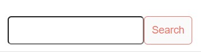
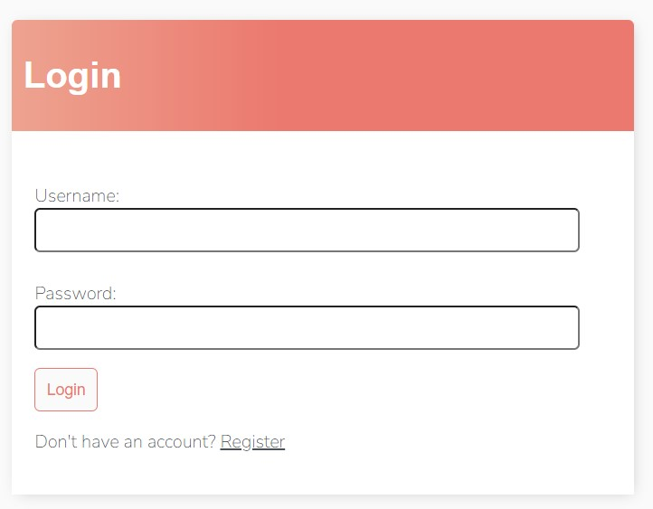
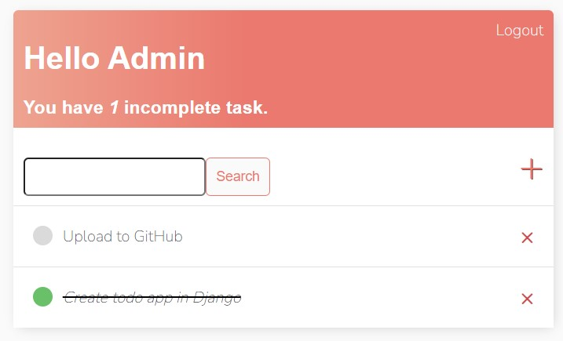
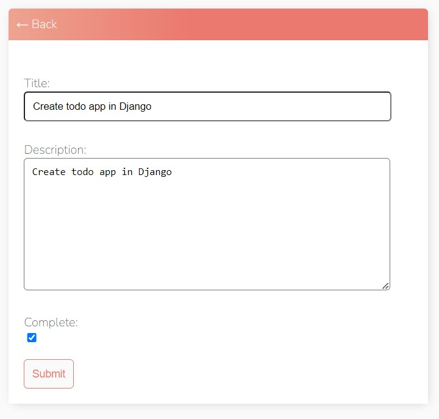
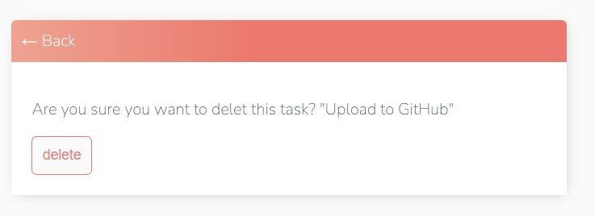
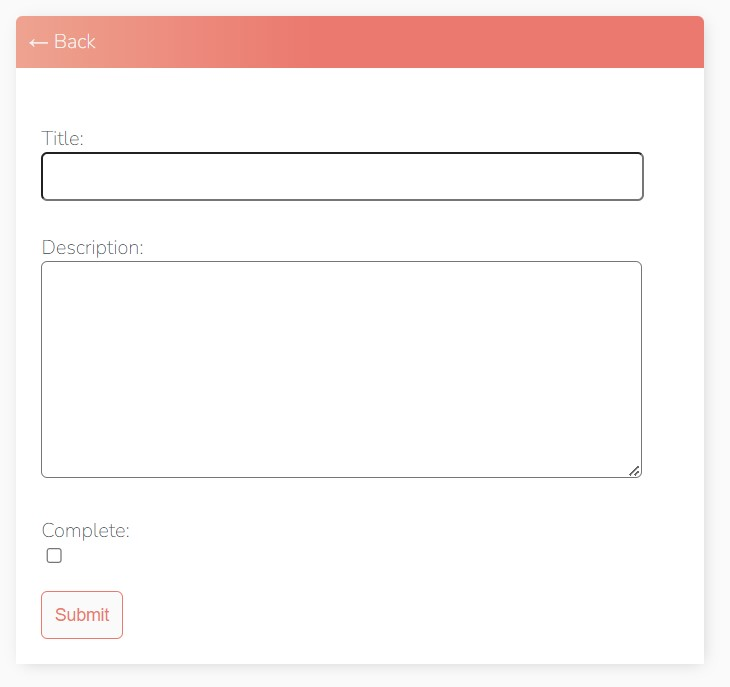
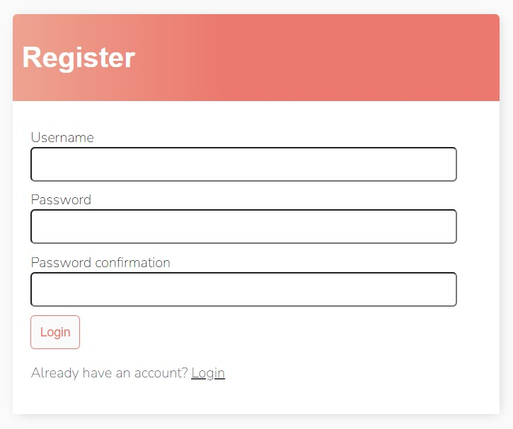

# Todo App with Django

## Introduction
This README provides an overview of the Todo app built using **Django**, highlighting the skills learned during its development and detailing the features it exhibits. 

This project demonstrates proficiency in various web development and Django-specific skills.

## Skills Learned
### Django Basics: 
I've gained a strong understanding of Django's fundamental concepts, including **models**, **views**, **templates**, and **URL routing**.

### Database Management: 
I've learned how to define and manage database models using **Django's Object-Relational Mapping (ORM)** and migrate databases using makemigrations and migrate commands.

The app also features a search bar to search for specific tasks:

### User Authentication: 
I've implemented user authentication and registration using Django's built-in authentication system. 

Users can create accounts, log in (using a CustomLoginView), and log out.

Further, I have utilizes th `LoginRequiredMixin` to make the app only accessible to logged-in users.

### CRUD Operations: 
I've mastered the basics of CRUD (Create, Read, Update, Delete) operations by allowing users to create, view, edit, and delete tasks.

This was implemented by utilizing the built-in class-based Django-views:

- ListView
- DetailView
- CreateView
- UpdateView
- DeleteView
- FormView (used for Register Page; includes form validation)
***
#### List View

#### Combined Detail View / Update View

#### Delete View

#### Create View

#### Form View

## Form Handling: 
I've gained experience in working with Django forms to handle user input for creating and editing tasks.

## User Interface (UI) Design: 
I've developed a clean and user-friendly interface using HTML, CSS, and Django templates to enhance the user experience.

## Static Files Management: 
I've learned how to serve static files (e.g., CSS and JavaScript) in a Django project and applied styling to the app.

## Validation and Error Handling: 
I've implemented form validation and error handling to ensure data integrity and provide users with meaningful feedback.

# App Features
1. User Authentication
    - User Registration: Users can sign up for an account by providing their username and password.

    - User Login: Registered users can log in using their credentials to access the app's features.

    - User Logout: Users can log out securely, ending their session.

2. Task Management
    - Create Tasks: Authenticated users can create new tasks by providing a task name and description.

    - View Tasks: Users can see a list of all their tasks, including task name, description and the status of completion.

    - Update Tasks: Users can edit task details, such as the name, description and completion status.

    - Delete Tasks: Users can delete tasks they no longer need.

3. User-Friendly Interface
    - The app has a clean and intuitive user interface, making it easy for users to navigate and manage their tasks.
4. Error Handling
    - Comprehensive error handling ensures users receive informative messages for incorrect input or unsuccessful actions.

# Getting Started
To run this Todo app locally, follow these steps:

Clone the repository to your local machine.

Activate a virtual environment and install django:

`python -m venv venv`

`pip install django`

Create a Django secret key and update it in the project's ``settings.py``.

Run database migrations with ``python manage.py makemigrations`` and ``python manage.py migrate``.

Create a superuser account using ``python manage.py createsuperuser`` to access the admin panel.

Start the development server with ``python manage.py runserver``.

Access the app in your browser at ``http://localhost:8000``.

Use the admin panel at ``http://localhost:8000/admin/`` to manage users and tasks.

# Source
- [This code is based on this tutorial](https://www.youtube.com/watch?v=llbtoQTt4qw&ab_channel=DennisIvy)
